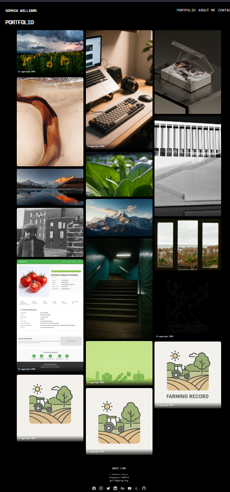

# 📸 Photography Portfolio (Nuxt 3 重构版)

[](https://nodejs.org/)
[](https://nuxt.com/)
[](./LICENSE)
[](https://lens.kdeer.top)

一个优雅的摄影作品集网站，基于 **Nuxt 3 + Vue 3 + TailwindCSS** 搭建。  
支持响应式布局，适合摄影师、设计师或旅行爱好者展示作品。  

👉 在线预览：[Demo 链接](https://lens.kdeer.top)

---

## 🎨 预览效果

---

## ✨ 功能特性
- 🖼️ **作品集画廊** — 展示摄影作品，支持分类/扩展  
- 📱 **移动端适配** — 在手机、平板和 PC 上都有极佳体验  
- 🎨 **现代前端技术栈** — Nuxt 3 + Vue 3 + Tailwind CSS  
- ⚡ **极速加载** — 支持静态生成 (SSG) 与服务端渲染 (SSR)  
- 🔧 **可扩展** — 未来可无缝接入 Strapi等 CMS。
---

## 🚀 快速开始(node版本推荐 22.19.0)

1. 克隆项目：
```bash
git clone https://github.com/augustqin0806/photography-portfolio-nuxt.git
cd photography-portfolio-nuxt
```
2.安装依赖：
```bash
# npm
npm install
```
3.启动开发环境：
```bash
# npm
npm run dev
```
4.构建生产环境：
```bash
# npm
npm run build
npm run preview
```

## 📁 项目目录说明（参考 Nuxt 模板）
├─ assets/       # 样式、图片等静态资源
├─ components/   # Vue 组件
├─ composables/  # 可复用逻辑 hooks
├─ layouts/      # 页面布局
├─ pages/        # 页面文件
├─ public/       # 公共静态资源
├─ plugins/      # Nuxt 插件
├─ stores/       # Pinia 状态管理
└─ nuxt.config.ts # Nuxt 配置

---

## 📂 文档说明
- [README.srcapi.md](./README.nuxt.md)：原始 nuxt 官方开发流程文档  
- 本 README：项目扩展说明与新功能记录  

---

## 🙏 致谢
- 原始模板：[JoaoFranco03/photography-portfolio](https://github.com/JoaoFranco03/photography-portfolio)  
- 技术支持：  
  - ⚡ [Nuxt 3](https://nuxt.com/)  
  - 🖖 [Vue 3](https://vuejs.org/)  
  - 🎨 [Tailwind CSS](https://tailwindcss.com/)  
  - 🎯 [Shadcn Vue](https://tailwindcss.com/)  
  - 🌐 [Uiverse](https://uiverse.io)
- 脚本灵感来源：[SimonAKing/AnimatedGallery](https://github.com/SimonAKing/AnimatedGallery)

---

## 📄 License
本项目基于 **GPL-3.0 License** 开源。  
- ✅ 你可以自由使用、修改和分发本项目  
- ⚠️ 但如果你修改或二次分发该项目，必须 **同样以 GPL-3.0 协议开源**  
- 👉 详细内容请见 [LICENSE](./LICENSE) 文件

